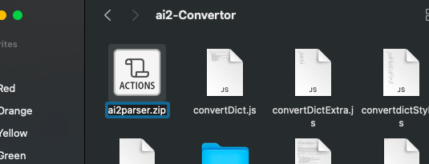

# ai2-Convertor
 Converts an App Inventor 2 .scm file to a HTML file

The project can be viewed at http://hei-dev.github.io/ai2-Convertor/index.html \
However, it will be updated at a non-regular schedule.\
The current version hosted on the website is dated at 19-10-2021

__For instructions on how to use it, skip to [here](#usage)__

-------------------
## Background

App Inventor provides a very easy-to-use UI, allowing you to create a UI that is what you want with instant preview. 
I have been using App Inventor since 2016 and since then I have learned actual coding.
Since then I (and my friend) have always been thinking of the idea of porting AI2 projects to other platform / IDEs.
We initally wanted to port it to Android Studio, but at the time neither of us knows how to use Android Studio / make Android apps with actual coding, and also we did not investigate about the App Inventor project file (.aia). Therefore, we did not make one. 
Fast forward to today, we have learnt many things since our idea back in 2016-17. I have recently gone back into AI2 and deep dive into the algrithm behind AI2. I have investigated in the aia file and learn about the aia project structure. Then I have decided to work on this project out of passion.

## Type of application
This app is intended to be able to run on any platform, no matter if you are a MacOS or Windows user, Desktop or Mobile user.\
This app is also intended to be able to run serverless so that the user can download the files and use it offline.

## Usage

1. Export your AI2 project as .aia
2. Extract the files from the aia file 
  a. For users who have installed file decompression software, 
    i. [Windows Only]For 7-zip users, Right click the file -> 7-Zip -> Extract to (Archive name) 
     
    ii. For others, open the file with the tools as if it is like an archive 
     (Refer to your decompression software for further information and instruction) 
  b. For users who does not have file decompression software, 
    - Rename "filename.aia" to "filename.zip"\
    Windows:\
    \
    MacOS:\
    
    - Right click the file -> Extract All... 
3. From the website, click "Choose File"
4. Navigate to 'your_extracted_folder\src\appinventor\username\your_aia_name\'
5. Select 'your_screen_name.__scm__'

## Planned features
-Support for uploading the entire aia file
-Generate JavaScript

#### This README is still work in progress.
