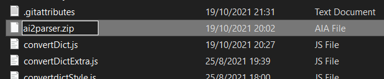

# ai2-Convertor
 Converts an app inventor 2 .scm file to a HTML file

This project can be viewed at http://hei-dev.github.io/ai2-Convertor/index.html

## Usage

1. Export your AI2 project as .aia
2. Extract the files from the aia file 
  a. For users who have installed file decompression software, 
    i. For 7-zip users, Right click the file -> 7-Zip -> Extract to (Archive name) 
    
    ii. For others, open the file with the tools as if it is like an archive 
    (Refer to your decompression software for further information and instruction) 
  b. For users who does not have file decompression software, 
    - Rename "filename.aia" to "filename.zip" 
    
    - Right click the file -> Extract All... 
3. From the website, click "Choose File"
4. Navigate to 'your_extracted_folder\src\appinventor\username\your_aia_name\'
5. Select 'your_screen_name.__scm__'

##### This README is still work in progress.
